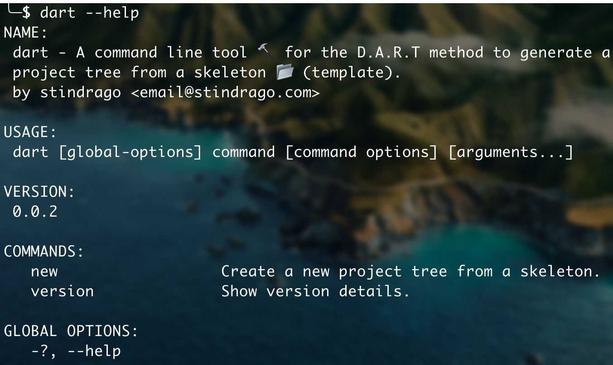

[dart-method]: https://stindrago.com/blog/#
[inkscape]: https://inkscape.org
[babashka-install]: https://github.com/babashka/babashka#installation

# dart-cli



## Introduction

**dart-cli** is command line tool to generate a project tree from a skeleton (template). The project tree is made of files and directories.

It is built as an utility software for the [D.A.R.T method][dart-method].

The idea is to help you stay organized by providing an easy way to start a project. Whenever you start a new project the structures is more or less the same. Instead of doing this manually you can generate the project tree with **dart-cli**.

## Goals

- [x] Generate projects from skeleton.
- [x] Display help.
- [ ] Manage namespaces (work, private, alter-ego-1...).
- [ ] Manage tags.
- [ ] Automatic versioning.
- [ ] Skeleton marketplace.
- [ ] GUI.

## Prerequisites

- Java
- [babashka][babashka-install]
- git

## Quickstart

``` shell
bash < <(curl -s https://gitlab.com/stindrago/dart-cli/-/raw/main/install.sh)
```

Then your are ready to run

```shell
dart new book my-awesome-book
```

## Example

Imagine you are a graphic designer and one of your friends asks you to create a logo for his new website. Before starting to work you think about the required materials: icons, fonts, images, notes, ecc. All these files you gather must be stored in an organized fashion somewhere.

The best thing to do is to start a new project called **the-awesome-logo**, structured like this.

``` text
the-awesome-logo
├── drawing.svg
├── README.md
└── assets
    ├── input
    └── renders
```

- In **drawing.svg** build the design with [Inkscape][inkscape].
- In **RADME.md** add details about the design: tasks, ideas, the delivery process, notes, ecc.
- In **assets/input** add the images you may use as a reference, the color palet or the fonts.
- In **assets/renders** add the logo exports as `.pdf` or `.png`.

## Customization

All skeletons are stored in `~/.config/dart-cli/skel`. You can create a custom skeleton by creating a new project similar to the [example](#example).
